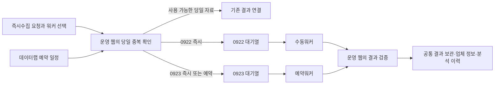

# 0922 수동키워드 워커 · 0923 예약키워드워커 개발·배포 계획

작성일: 2026-09-23. 상태: 기능 개발 및 로컬 모의 검증 완료. 운영 배포·서비스 재개·예약 활성화 전. 구현 안내와 검증 범위는 [collector-roles-development.md](collector-roles-development.md)를 참고한다.

사용자가 확정한 정식 표기는 **0922 수동키워드 워커**, **0923 예약키워드워커**이며, 화면과 설명의 짧은 표기는 각각 **수동워커**, **예약워커**로 통일한다. 최신 설계 요청에 따라 **수동워커는 즉시수집**, **예약워커는 즉시수집과 데이터랩에서 설정한 예약수집 모두**를 지원한다. 워커 이름과 실행 방식은 별도로 관리한다. 현재 Render에 확인된 이름은 각각 `0922 수집워커`, `0923 수집워커`이며, 이번 문서 수정으로 실제 서비스 이름을 변경한 것은 아니다.

이번 요청은 개발·배포 계획 수립과 당일 중복수집 방지 기준 추가이다. 예약 시각·키워드·순위·날짜 범위·요청 속도·최초 실행일은 아직 새로 확정하지 않았다. 기존 오후 2시·13개 키워드 정책은 비활성 상태로 보존한다. **수동·예약 구분 없이 같은 날 같은 키워드의 기존 작업과 정상 결과를 먼저 확인하고, 요청 범위가 충족되면 당일 반복수집을 하지 않는 것을 기본 원칙으로 한다.**

## 1. 목표와 현재 기준

| 구성 | 현재 확인된 상태 | 개발 후 역할 |
| --- | --- | --- |
| 운영 웹 `glamping-datalab-v2` / `srv-da9q6don74is738t7id0` | 화면·분석·결과 보관, 단일 수집 대기열 | 선택한 워커로 배정, 즉시·예약 실행 관리, 결과 검증·보관 |
| `0922 수집워커` / `srv-d9q6mrfavr4c73atllf0` | 실행 중, Background Worker, CPU 0.5·512MB, 영구 디스크 없음 | 사용자가 수집 버튼으로 요청한 작업만 실행 |
| `0923 수집워커` / `srv-d9jf91v41pts73cj9bu0` | 중지 상태, 유료 Web Service, CPU 0.5·512MB, `/var/data` 1GB | 관리자의 즉시수집과 데이터랩 예약 작업 실행 |
| `glamping-datalab-v2-archive` / `srv-da27j1flk1mc73av5ps0` | 보관용 웹, 배포 `4e4e190` | 기존 수집 기능의 비교 기준 |

코드 점검 기준은 `e1cfcfd5075a4f19b777389470b87919b9d8d7d3`이며 점검 시작 시 작업 폴더는 깨끗했다. 서비스 사양과 상태는 같은 작업에서 2026-09-23 Render 화면으로 확인했다. 실행 직전 다시 확인한다.

현재 아카이브와 0922는 같은 계열의 수집 프로그램을 사용한다. 사용자 요청에 따라 0923은 아카이브의 수집 기능을 기반으로 검토하되, **구형 프로그램 전체를 실행하고 파일 전송만 추가하는 방식은 채택하지 않는다.** 아카이브 수집 코어에 현재 공통 실행·차단 감지·결과 검증·파일 전송을 결합하고, 누락·실패·객실·상품 근거를 현재 데이터랩이 정확히 읽는지 먼저 검증한다. 근거가 소실되는 구형 전처리와 현재 품질 계약을 충족하지 못하는 부분은 이식 전에 보강한다. 새로운 매출 추정 모델을 만드는 작업은 포함하지 않지만 기존에 합의한 최대 객실량·데이유즈 기준의 퇴행 방지는 필수이다. 세부 사전 검토는 9절에 정리한다.

## 2. 확정할 실행 구조

- 워커별 대기열과 실행 상태를 분리한다. 각 워커는 자기에게 배정된 작업 한 건씩만 실행한다. 0923의 즉시수집과 예약수집은 같은 대기열과 실행권을 공유한다.
- 서로 다른 워커의 작업을 처리할 수 있는 구조를 만든다. 실제 두 작업 동시 수집은 별도 부하 검증을 거친다. 같은 워커에 요청이 겹치면 대기시키고 진행 중 작업을 강제 중단하거나 두 개를 동시에 실행하지 않는다.
- 예약 시계와 일정 장부는 운영 웹 한 곳에서 관리한다. 0923은 작업을 받아 실행하며 별도 스케줄러를 만들지 않는다. Codex나 사용자 PC의 상시 실행을 요구하지 않는다.
- **실행 대상(`workerId`)과 실행 방식(`trigger`)을 분리한다.** 즉시 실행은 `manual`, 예약 시각 도래에 따른 실행은 `scheduled`로 서버가 지정한다. 관리자 즉시수집 화면은 0922 또는 0923을 명시적으로 선택할 수 있고 기본값은 기존처럼 0922이다. B2B 검색은 기존 0922 경로를 유지한다. 브라우저의 임의 `scheduledCollection` 플래그로 워커·예약 실행 권한을 바꿀 수 없도록 검증한다.
- 0923의 `지금 수집`은 한 번의 작업이며 다음 예약 시각·반복 설정·예약 활성화 상태를 바꾸지 않는다. 예약 설정이 꺼져 있어도 워커가 정상 대기이고 즉시 실행 권한이 있으면 즉시수집할 수 있다. 서비스 중지·작업 수령 중지·차단 보호는 즉시/예약 모두에 적용한다.
- 한 워커가 연결되지 않거나 실패하면 해당 작업을 보류한다. 다른 역할의 워커 또는 운영 웹에서 대신 재수집하지 않는다.
- 0922의 기본 속도 설정은 유지한다. 비활성인 기존 예약 정책에 저장된 부하 제한 값도 보존한다. 0923은 즉시/예약 각각의 실행 조건에 요청 속도를 명시하고 유효 설정을 작업 시작 전에 표시한다. 구체적인 속도 값은 해당 실행 조건 확정 때 정하며 즉시 실행이 예약 속도 설정을 덮어쓰지 않는다.
- 위 대기열 앞에는 두 역할이 공유하는 당일 중복 확인 절차를 둔다. 실행 역할별 배정과 데이터 재사용 판단은 별도로 관리하여, 워커가 다르다는 이유로 같은 자료를 다시 수집하지 않는다.

## 3. 개발 작업

### 3-1. 워커별 배정과 실행 방식·인증

`scripts/glamping_app_server.cjs`, `collector_dispatch.cjs`, `collector_broker.cjs`, `collector_worker.cjs`를 수정한다.

- 현재 전역 1개인 `activeCrawl*`, `activeCollectorJobId`, 대기열을 워커별 상태로 분리한다. 진행·취소·시간 측정에는 실제 워커와 실행 방식을 각각 기록한다. **당일 데이터 재사용 키에는 즉시/예약·워커 ID를 넣지 않고**, 별도의 공통 중복 확인 장부를 사용한다. 데이터 접근 권한은 기존 규칙대로 별도로 확인한다.
- 예약 스케줄러는 0922 작업 때문에 정지하지 않는다. 0923이 즉시수집 중이어도 도래한 예약을 중복 없이 대기열에 기록하고 현재 작업 종료 후 실행한다. 아직 시작하지 않은 작업 중에는 실행 시각이 지난 예약을 우선하며, 진행 작업을 선점하지 않는다. 같은 우선순위는 접수 순서대로 처리한다. 지연 사유·예상 대기를 표시하고 허용 실행일을 넘기면 자동으로 다음 날 밀어 실행하지 않고 미실행 사유를 남긴다.
- 중지 중 놓친 예약들을 재가동 때 한꺼번에 실행하지 않는다. 중복 확인·유효 실행일·실행 권한을 확인하고 미실행 기록과 다음 예정 시각을 표시한다.
- 워커별 ID·인증값·배정 장부·연결 시각·오류 상태를 분리한다. 서버 등록표에서 0922에는 `manual`, 0923에는 `manual`과 `scheduled` 실행을 허용한다. 워커 인증과 관리자 워커 선택 권한을 서버에서 확인한다.
- 기존 0922의 ID·인증과 `/var/data/collector` 장부 경로는 호환성을 유지한다. 새 예약 장부는 `/var/data/collector-scheduled`에 둔다. 두 broker가 같은 상태 파일을 동시에 쓰지 않도록 저장 경로를 인자로 분리한다.
- 워커는 전달받은 대상 워커·허용 실행 방식·jobId·요청 조건을 실행 전에 확인한다. 다른 워커에 배정된 작업이나 허용되지 않은 실행 방식은 네이버 요청 전 거절한다. 0923의 즉시수집도 `scheduledCollection=false`이고, 실제 예약 시각에 생성한 작업만 `true`로 기록한다.
- 기존 완료 영수증은 원래 기록을 보존한다. 역할이 기록되지 않은 과거 자료를 추측해서 다시 분류하지 않는다.
- 토큰·계정값은 Render 비밀 설정에서만 관리하고 로그·결과 파일·공개 상태 응답에 넣지 않는다.

### 3-2. 0923용 실행 프로그램

`scripts/collector_worker_web.cjs`와 `start:collector-worker-web` 시작 명령을 추가한다.

- 0923은 기존 Web Service를 재사용한다. Render의 서비스 유형은 그대로 두고, 수집 워커 루프와 작은 상태 확인용 HTTP 서버를 같은 실행 프로그램에서 구동한다.
- `0.0.0.0:$PORT`를 열고 `/api/health`는 상태 확인만 제공한다. 공개 URL에서 수집 시작·작업 목록·파일·계정 기능은 제공하지 않는다.
- 정상 대기, 예약 비활성, 차단으로 인한 보호 대기는 프로그램 고장과 구분한다. 수집 루프가 비정상 종료되면 상태 확인 서버만 정상인 것처럼 남지 않도록 함께 종료한다.
- 0923의 작업 폴더는 `/var/data/collector-work-0923`로 지정한다. 기존 1GB 디스크의 다른 자료를 덮어쓰지 않는다. 전환 전 여유 공간을 확인하고, 새 작업 전 200MiB 보호 기준과 예상 작업 공간을 검사한다.
- 결과 전송 확인 후 해당 작업의 임시 자료만 정리한다. 전송 실패·중단 자료는 보존하며, 재시작했다고 수집을 다시 시작하지 않는다. 재전송도 동일 jobId와 서버 상태를 확인한 경우에만 허용한다.
- 전체 웹 앱을 실행하는 기존 `npm start` 대신 새 전용 시작 명령을 사용한다. 오래된 웹 앱·예약 기능·계정 기능이 함께 실행되지 않도록 시작 경로를 검증한다.

Web Service에 필요한 포트와 상태 확인 조건은 [Render Web Services](https://render.com/docs/web-services), [Health Checks](https://render.com/docs/health-checks)를 따른다. [서비스 유형은 생성 후 직접 변경할 수 없다](https://render.com/docs/blueprint-spec#essential-fields). 영구 디스크는 해당 서비스에서만 접근 가능하므로 결과 통합은 파일 전송으로 처리한다([Persistent Disks](https://render.com/docs/disks)).

### 3-3. 동시 결과 저장과 중복 방지

역할별 실행만 분리하면 공통 결과 폴더와 업체 파일이 충돌할 수 있으므로 다음을 필수로 구현한다.

- 중앙에서 jobId와 결과 식별자를 정하고 예약한다. 당일 중복 확인으로 동일 범위 요청은 한 작업에 연결한다. 서로 다른 범위 또는 명시적 예외로 같은 키워드·같은 초에 두 작업을 실행하는 경우에도 결과 폴더가 달라야 한다.
- 현재 runId 끝의 `_glamping_YYYYMMDD_HHMMSS` 읽기 규칙을 우선 보존한다. 고유 역할·작업 토큰을 앞부분에 넣는 방식을 검토하며, 토큰은 기존 날짜 추출 규칙과 충돌하지 않는 영문자로 인코딩한다. 실제 관측 시각은 manifest에 정확히 기록한다.
- 새 식별자에 대해 구·신 결과 목록, 날짜 표시, 다운로드, 업체 연결, 분석 이력, broker 검증과 직전 버전의 읽기 호환성을 시험한다. 호환되지 않으면 새 ID를 내보내기 전에 호환 리더 버전을 먼저 배포한다.
- 업로드 폴더는 역할·jobId별로 격리한다. SHA-256·크기·허용 경로·manifest 조건과 수집 품질 검증 후 공통 결과 폴더에 한 번만 게시한다.
- 업체 기준정보·매출 이력 등 공통 파일의 읽기→수정→쓰기는 하나의 저장 절차로 직렬화한다. 수집 완료 경로뿐 아니라 상세보기 GET의 보완 저장과 관리자 수정도 같은 잠금 규칙을 사용한다.
- 실행 시간 기록도 같은 방식으로 보호한다. SQLite 기준 DB에 반영하는 기존 공용 `createMasterDbDualWriteQueue`는 하나로 유지하고 두 역할의 검증 완료 결과가 이 큐를 이용하게 한다.
- 최신 기준정보 선택은 실제 관측 시각을 따른다. 늦게 완료된 오래된 관측이 더 최신 관측을 덮지 않도록 한다.
- 동일 완료 응답을 여러 번 받아도 분석 이력이 중복되지 않아야 한다. 저장 완료·분석 반영 단계를 기록하여 서버 재시작 후에도 확인 가능하게 한다.
- 부분·실패·차단 결과는 증거로 보관하고 정상 분석 기준값 갱신을 보류한다. 수집 품질 검증과 추정 매출 정확성은 별개의 판단이다.

### 3-4. 오류·차단·취소 처리

- 연결 끊김·워커 종료·파일 전송 실패는 해당 역할의 상태에 기록한다. 실패한 작업을 자동 재수집하지 않는다.
- HTTP 403·429 및 HTTP 200의 `BookingAPITooManyRequests` 감지 후 해당 워커의 새 네이버 요청을 중단하는 현재 보호를 유지한다.
- 확인된 네이버 차단은 공통 공급자 보호 상태에도 반영해 양쪽의 새 배정을 보류하고 진행 중 작업에 중단을 전달한다. 한쪽 차단 후 다른 워커로 옮겨 계속 수집하지 않는다. 워커 간 중단 전달 시간은 검증에서 측정한다.
- 기존의 파일·데이터 무결성 오류는 별도 운영 오류로 표시한다. 불명확한 실패를 네이버 차단으로 단정하지 않는다.
- 취소는 선택한 역할·jobId에만 적용한다. 관리자의 전체 수집 중단 기능은 두 역할을 명시적으로 표시한다.
- 보호 해제는 역할 오류와 공통 네이버 보호를 구분하고 원인·실행 상태 확인 후 처리한다. 단순 재배포가 보호 해제가 되어서는 안 된다.

### 3-5. 운영 화면

- `수동워커`와 `예약워커` 상태 카드를 나란히 표시하고, 상세에는 정식 이름 `0922 수동키워드 워커`, `0923 예약키워드워커`를 표시한다. 모바일에서는 같은 순서로 쌓는다.
- 카드에는 연결 상태, 현재 키워드, 진행 시간, 대기 건수, 최근 결과, 중단 사유를 표시한다. 상세 설정은 접어 둔다.
- `연결 정상`, `수집 중`, `예약 미설정`, `중지`, `차단으로 보류`를 구분한다. 최근 연결만으로 수집 중이라고 표시하지 않는다.
- 결과 카드와 보관함에는 `수동워커 · 즉시수집`, `예약워커 · 즉시수집`, `예약워커 · 예약수집`처럼 실제 워커와 실행 방식을 함께 표시한다. 결과를 보거나 분석하는 위치는 기존 STAYDATALAB을 유지한다.
- 관리자 수집 화면은 `수집할 워커: 수동워커 / 예약워커`와 `실행: 지금 수집 / 예약 설정`을 구분한다. 수동워커에서 예약 설정은 제공하지 않는다. 예약워커 카드에는 `지금 수집`과 `예약 설정` 진입 버튼을 둔다. 실행 전 중복 자료·연결 상태·대기 현황·실행 범위를 보여준다.
- 데이터랩 안의 예약 설정에는 키워드 목록·순서, 한국시간 기준 한 번 실행/매일/요일별 반복, 실행 시각·최초 실행일, 상세 순위·수집 목적·상품·인원, 수집할 날짜 범위·요청 속도를 담는다. 매일 이동하는 날짜 범위와 고정 날짜 범위를 구분하고 유효하지 않거나 과거가 된 범위는 실행 전에 확인한다. 저장과 활성화를 분리하고, 활성화 전 다음 실행 시각과 대상 범위를 보여준다. 편집한 설정은 이후 작업부터 적용하고 이미 접수된 작업 조건은 보존한다.
- 저장된 예약 조건으로도 `지금 한 번 수집`할 수 있게 하되 설정 사본을 가진 새 즉시 요청으로 처리한다. 이 버튼으로 예약을 활성화하거나 다음 실행 시각을 이동하지 않는다. 이후 예약 시각에는 당일 중복 확인을 다시 수행해 동일 범위의 정상 자료가 있으면 `기존 자료 사용`으로 처리한다.
- `예약 일시정지`는 앞으로의 예약 발생을 막고 아직 시작하지 않은 해당 예약 작업을 보류한다. 별도로 접수한 즉시 작업과 이미 진행 중인 수집은 자동 취소하지 않는다. `워커 작업 수령 중지`와 개별 작업 취소는 별도 기능으로 표시한다.
- 기존 상태 API의 수동수집 필드를 호환 유지하면서 역할별 상태를 추가한다. 일반 사용자에게는 본인 작업만, 관리자에게는 두 역할의 운영 상태를 제공한다.

### 3-6. 같은 날 중복 키워드 확인과 반복수집 방지 — 필수 개발 항목

2026-09-23 사용자 추가 요청에 따라 다음 기준을 개발·배포 검수에 포함한다. 이는 **설계 반영**이며 운영 서버의 당일 수집 이력을 전수 조사했거나 중복 방지를 이미 배포했다는 의미는 아니다.

현재 코드에서 확인한 한계:

- 일반 수집의 완료 결과 재사용은 기본 5분의 메모리 캐시이며, 서버 재시작 후 당일 이력을 보장하지 않는다.
- B2B 키워드 검색에는 기본 30분의 별도 이력 재사용이 있지만, 관리자 수동수집과 예약수집 전체를 합친 당일 기준은 아니다.
- 현재 `crawlPayloadSignature`에는 `scheduledCollection`, `collectionSource`, `sourceRole`이 포함되어 같은 자료 요청도 수동·예약 경로에 따라 달라질 수 있다.
- 실제 수집에 쓰는 성인 수는 현재 서명에 빠져 있으므로 새 공통 범위 비교에는 반드시 포함한다.
- 기존 예약 장부는 자기 일정의 중복 실행을 막지만, 별도 수동수집 결과까지 확인하는 공통 장부가 없다.
- 현재 코드에 정의된 기존 예약 키워드 13개에는 동일 문자열 중복이 없다. 이는 운영 서버의 당일 수동·예약 실행 이력을 대조한 결과는 아니다.

개발 기준:

1. **한국시간 당일 기준:** 서버의 한국시간 날짜와 실제 수집 시작·관측 시각을 사용한다. 숙박일·파일명 날짜·결과를 다시 연 날짜를 수집일로 대신 사용하지 않는다. 자정을 넘긴 작업은 원래 시작일과 실제 관측 구간을 보존하고, 진행 중인 동일 작업을 새날 작업으로 중복 시작하지 않는다.
2. **양쪽을 합쳐 먼저 확인:** 수동 요청 접수 시, 예약 목록 저장 시, 예약 실행 직전 공통 장부에서 같은 날의 같은 키워드를 확인한다. 완료 자료뿐 아니라 대기·수집·전송·검증 중인 작업도 확인한다. 예약 목록 안의 동일 키워드 중복도 저장 단계에서 알린다.
3. **키워드와 조건 구분:** 앞뒤 공백·유니코드 표현처럼 의미가 바뀌지 않는 차이를 정규화하고 원문을 보존한다. 검색어 내부 공백·유사 지역명 등 검색 결과가 달라질 수 있는 표기는 중복 후보로 표시하되 근거 없이 합치지 않는다. 검색 방식·지역 범위·성인 수·상품·상세수집 목적·순위·예약 날짜 범위 등 결과에 영향을 주는 조건을 비교한다.
4. **정상 완료 자료 우선 사용:** 같은 조건 또는 요청 범위를 모두 포함하는 당일 정상 자료가 있으면 추가 네이버 요청 없이 기존 runId를 사용한다. 예를 들어 당일 동일 조건의 상세 1~20위·31일 자료가 있으면 그 안에 포함되는 1~5위·1일 요청을 재사용할 수 있다. 실제 manifest와 파일이 범위를 충족하고 품질 검증을 통과했는지 확인하며, 요청 범위만 화면에 표시한다.
5. **진행 중이면 기존 작업에 연결:** 동일 범위를 충족하는 대기·진행 작업이 있으면 새 수집을 만들지 않는다. 동시에 두 요청이 들어와도 공통 장부의 배타적 등록을 먼저 성공한 한 작업만 실행한다. 자정 경계에서는 진행 중 작업 잠금도 함께 확인한다. 다른 사용자의 작업 상세·개인 정보는 노출하지 않으며, 연결한 요청 하나의 취소가 공유 수집 전체를 임의로 중단하지 않도록 한다.
6. **범위가 부족하면 별도로 표시:** 1~5위·1일 자료로 1~20위·31일 요청이 끝났다고 처리하지 않는다. 필요한 추가 범위를 보여주고 기존 자료 재사용을 기본으로 안내한다. 첫 단계에서는 부족 범위를 이유로 전체 자동 재수집을 하지 않는다. 부족분만 추가 수집하는 기능은 대상·날짜별 완전성 검증이 가능한 별도 구현 항목으로 둔다.
7. **예외 반복수집은 의도적으로 실행:** 최신 변경 확인·조건 변경 등 당일 재수집이 필요한 경우 관리자에게 기존 수집 시각과 추가 범위를 보여주고 별도 재수집 동작·사유를 기록한다. 일반 버튼 클릭이나 예약 도래만으로 예외를 적용하지 않는다. 실패·부분·차단 자료는 정상 완료로 재사용하지 않으며 자동 재시도를 만들지 않는다. 차단 보호 상태에서는 예외 재수집도 실행하지 않는다.
8. **이력과 통계의 의미 보존:** `오늘 자료 사용`, `진행 중인 수집에 연결`, `추가 범위 확인 필요`를 표시한다. 실제 수집일·시각·실행 워커·원본 runId를 유지하고 새 요청 시각과 구분한다. 예약 결과를 수동 화면에서 사용해도 실제 실행 워커를 수동으로 바꾸지 않는다. 재사용은 새 관측·매출 이력·실제 수집 횟수에 중복 집계하지 않고, 예약 장부에도 `기존 자료 사용`으로 연결한다.
9. **영속 장부와 배포 전 점검:** 재시작 후에도 두 역할의 중복 판단이 유지되도록 공통 장부를 저장한다. 기존 당일 manifest·작업 장부에서 읽기 전용으로 재사용 후보를 확인하고 품질·범위·파일 존재를 검증한다. 상태가 불명확하면 먼저 확인하며 새 수집을 즉시 시작하지 않는다. 배포 전 당일 이력으로 `키워드 / 실행 시각 / 조건 / 워커 / 정상·부분·실패 / runId / 중복 사유` 표를 확인한다. 기존 결과를 삭제·합치거나 기록의 수집 시각을 바꾸지 않는다.

원래 결과를 다른 역할의 새 수집처럼 다시 업로드하지 않는다. broker의 출처·예약 여부 검증은 유지하고, 중앙 접수 단계에서 기존 runId를 가리키는 재사용 기록을 남긴다. 예약 장부가 `기존 자료 사용` 상태와 실제 신규 완료 상태를 구분하도록 상태 검증·조회·통계도 함께 수정한다.

## 4. 검증과 완료 기준

| 검증 상황 | 통과 기준 |
| --- | --- |
| 관리자 즉시 요청에서 0922 또는 0923 선택 | 선택한 워커에서 `manual`로 실행, 각 워커 한 건씩 실행 |
| 관리자 권한 없이 워커를 바꾸거나 예약 플래그를 보냄 | 권한 검증 후 거절, 임의 워커·예약 경로로 전환되지 않음 |
| 0923 즉시수집 중 예약 시각 도래 | 예약은 한 번만 대기 등록, 진행 작업 종료 후 실행, 동시 실행 없음 |
| 예약이 꺼진 상태에서 0923 지금 수집 | 즉시 요청만 실행, 예약 활성화·다음 실행 시각 변경 없음 |
| 저장된 예약 조건으로 즉시 실행 후 같은 날 예약 도래 | 정상 자료가 범위를 충족하면 재사용, 실제 반복수집 없음 |
| 예약 일시정지와 워커 수령 중지·취소 | 각 동작의 적용 범위가 구분되고 진행 작업을 임의 종료하지 않음 |
| 접수 후 예약 조건 편집 | 접수·진행 작업의 조건은 보존하고 이후 작업부터 수정값 적용 |
| 0923에 즉시 요청이 계속 들어옴 | 이미 도래한 예약은 진행 중 작업 종료 후 우선 처리, 병렬 실행 없음 |
| 다른 워커 ID·토큰·역할·jobId로 접근 | 실행·진행 보고·업로드·완료·취소 모두 거절 |
| 범위 차이 또는 명시적 예외로 필요한 같은 키워드·같은 초의 두 수집 | runId 충돌 없이 두 결과가 저장·조회됨 |
| 두 완료 + 관리자 수정 + 상세보기 보완 저장 | 업체 정보·이력 유실 및 중복 없이 반영 |
| 완료 응답 유실 후 동일 파일 재전송 | 수집 재실행 없이 동일 결과 확인, 중복 게시 없음 |
| 한 워커 종료·통신 실패·재시작 | 상태가 해당 작업에 귀속, 다른 역할로 자동 대체하지 않음 |
| 403·429·HTTP 200 내부 제한 응답 | 후속 요청 중단, 공통 배정 보류, 결과 정상 반영 금지 |
| 부족한 디스크·손상 파일·범위 불일치 | 새 작업 또는 결과 반영을 멈추고 명확한 이유 표시 |
| 오래된 runId와 새 runId | 목록·날짜·분석·다운로드·복구 버전에서 정상 조회 |
| 0923 상태 확인 | 대기는 정상, 실행 루프 고장은 정상으로 표시하지 않음 |
| 한국시간 자정·재시작·동일 예약 중복 등록 | 실행일 판정 일치, 동일 예약은 한 번만 등록 |
| 예약 비활성 상태에서 시각 경과·재시작 | 자동 발생한 예약 작업이 0건으로 유지됨; 별도 즉시 요청과 구분 |
| 당일 수동 완료 후 동일 조건 예약 또는 그 반대 | 기존 정상 runId 재사용, 추가 외부 수집 0회 |
| 동일 키워드·조건을 양쪽에서 동시에 요청 | 공통 장부에 실제 작업 1건만 등록, 두 요청은 같은 결과 참조 |
| 당일 1~20위·31일 완료 후 포함되는 1~5위·1일 요청 | 범위·품질 확인 후 기존 자료 사용, 새 관측으로 중복 집계하지 않음 |
| 당일 1~5위·1일 완료 후 1~20위·31일 요청 | 부족 범위 표시, 완료로 오인하거나 전체를 자동 재수집하지 않음 |
| 재시작·한국시간 자정·전날부터 진행 중인 작업 | 날짜 판정과 실제 관측 시각 보존, 당일 이력 유실·동시 중복 시작 없음 |
| 실패·부분·차단 자료만 있거나 파일 누락 | 정상 자료로 재사용하지 않음, 자동 재시도·보호 해제 없음 |
| 당일 자료 재사용을 여러 번 요청 | 실제 수집 횟수·관측 이력은 증가하지 않고 재사용 이력만 기록 |

우선 기존 워커·일정·품질 회귀 검사와 외부 요청 없는 모의 웹→두 워커 통합 검사를 통과시킨다. 0923에서 실제 재개 후에는 메모리 최대치·디스크·연결 상태를 확인한다. 512MB가 장시간 수집에 충분하다고 미리 단정하지 않는다.

실제 네이버 소량 검증은 앞으로 확정하는 키워드·날짜·순위와 새로운 실행 키로 한 번 진행한다. 기존 9월 22일·23일 테스트를 재실행하지 않는다. 모의 검사나 HTTP 200만으로 실제 수집 성공을 선언하지 않는다.

## 5. 배포 순서

1. **아카이브 적합성 검증 후 개발:** 9절의 수집 코어·데이터 의미·전송 계약 검증을 먼저 수행한다. 현재 운영 상태를 기준으로 작업 브랜치에서 구현하고, 외부 요청 없는 두 워커 통합 검증, 저장 경합·구버전 읽기·복구 검증을 완료한다. 두 엔진이 의미가 다른 수치를 생성하면 동일한 추이로 합치기 전에 원인과 호환성을 해결한다.
2. **운영 전 사전 확인:** 새 접수를 잠시 보류하고 진행·대기·업로드·완료 확인 중 작업이 모두 없는지 확인한다. 보호 상태와 디스크 여유를 확인하고 기존 일정·장부·설정의 안전한 복구 사본을 보존한다. 진행 중 수집이 있으면 완료 후 배포한다. 영구 디스크가 있는 웹·0923은 재배포 때 짧은 서비스 중단이 발생할 수 있으므로 이 시간을 배포 안내에 포함한다.
3. **운영 웹 먼저:** 기존 0922 연결을 받아들이는 호환 버전을 배포한다. 예약은 비활성으로 유지한다. 단일 큐가 남은 구버전 웹보다 새 워커를 먼저 투입하지 않는다.
4. **0922 갱신:** 같은 검증 커밋을 배포해 수동 전용 역할을 적용한다. 기존 수동 버튼·진행 표시·취소·결과 조회를 확인한다. 기본 속도와 차단 보호를 유지한다.
5. **0923 준비·배포:** 새 커밋, 전용 시작 명령, 즉시/예약 허용 설정, 별도 인증값, 작업 폴더, 상태 확인 경로를 먼저 설정한다. 기존 구형 웹 앱이 먼저 실행되지 않도록 적용 상태를 확인한 뒤 명시적으로 배포·재개한다. 0923 작업 수령 스위치는 꺼 둔다.
6. **대기 연결 확인:** 웹·0922·0923의 실제 커밋과 서비스 ID, 역할별 연결·장부, 디스크·메모리, 공개 상태 확인 경로를 확인한다. 예약이 꺼진 채 정상 대기해야 한다.
7. **실제 소량 검증:** 정해진 테스트 조건으로 0923의 즉시 실행부터 결과 파일·품질·보관함·분석 반영까지 확인한다. 반복 예약은 비활성으로 유지한다. 예약 실행 경로·동일 워커 대기 처리·당일 재사용을 검증하고, 두 워커 동시 실행 시험은 별도 단계로 두고 합산 부하를 측정한다.
8. **예약 운영 개시:** 사용자와 시각·키워드·순위·기간·속도·최초 실행일을 확정한 뒤 활성화한다. 기존 오후 2시·13개 키워드 설정을 자동으로 되살리지 않는다. 다음 예약 1회 결과와 이후 지속 관측으로 장시간 운영 여부를 판단한다.

개발 완료, Render 배포·대기 완료, 실제 소량 검증 완료, 예약 운영 개시는 각각 별도 상태로 보고한다. 배포 과정의 유료 0923 재개 시점도 보고한다. 현재 요청으로는 이 계획 문서만 작성한다.

## 6. 복구 계획

- 0923의 즉시/예약 새 작업 배정을 먼저 중지하고 진행·전송 중 작업을 확인한다. 예약만 끄고 0923 즉시 요청이 계속 들어오는 상태를 복구 준비 완료로 보지 않는다. 원본·완료 영수증·기존 업체 자료는 삭제하지 않는다.
- 0922는 수동 전용으로 유지한다. 0923 실패 작업을 0922나 운영 웹에서 자동 실행하지 않는다.
- 새 결과를 읽을 수 있는 직전 검증 버전과 수동 전용 설정으로 되돌린다. `e1cfcfd`를 복구 대상으로 사용할 경우 새 ID·manifest·이력 파일을 읽는 시험을 먼저 통과해야 한다.
- 현재 장부를 예전 사본으로 덮어쓰지 않는다. 중단·실패 기록을 보존하고 데이터 구조가 바뀌었다면 검증된 변환 또는 호환 모드를 사용한다.
- 네이버 보호 상태는 복구·재시작 이후에도 유지한다. 재개는 원인과 실행 여부 확인 후 별도로 결정한다.

## 7. 비용과 범위

같은 작업에서 확인한 현재 Render 사양 기준, 0922는 월 $7, 0923은 가동 시 월 $7과 1GB 디스크 월 $0.25의 기본 단가다. 두 수집기 합계는 상시 가동 기준 월 약 $14.25이며 운영 웹·추가 트래픽·세금 등은 별도다. 이는 현재 청구액이나 이번 변경의 정확한 순증액이 아니다. 배포 직전에 [각 서비스 Compute](https://dashboard.render.com/web/srv-d9jf91v41pts73cj9bu0/compute)와 Billing을 다시 확인한다.

이번 개발 범위는 역할 분리, 예약 전용 실행 프로그램, 결과 통합의 동시성, 당일 중복 키워드 확인·자료 재사용, 운영 상태 화면, 검증·복구이다. 일정과 수집 범위를 자동 확장하거나 새 서버를 추가 구매하는 작업은 포함하지 않는다. 사양 증설은 실제 자원 사용 측정 후 판단한다.

## 8. 코드 검토 근거

- `scripts/glamping_app_server.cjs`: 258행 부근의 전역 실행 상태, 284행 대기열, 290행 스케줄러 `isBusy`, 1395행 다음 작업 시작, 17310행 워커 전달, 18308행 수동 요청 진입점.
- `scripts/collector_broker.cjs`: 248행 broker 생성과 고정 장부 경로, 429행 단일 실행권, 570행 이후 결과 게시.
- `scripts/collector_worker.cjs`: 39행 실행 설정, 127행 작업 검증, 149행 임시 폴더, 295행 이후 전송, 348행 작업 수령 루프.
- `scripts/gyeongnam_glamping_crawl.cjs`: 776~778행 runId/결과 경로와 797행 부근 단계별 동시 처리 기본값.
- `scripts/glamping_app_server.cjs`: 9891행 부근 업체 파일 쓰기, 12815행 기준정보 반영, 14356행 이력 반영, 16552행 결과 조회와 파생 데이터 갱신.
- `scripts/glamping_app_server.cjs`: 295~303행 재사용 유효시간, 1061행 `crawlPayloadSignature`, 3764행 B2B 재사용 허용, 3827행 완료 이력 조회, 17096행 `runCrawler`의 캐시·진행 작업 확인.
- `scripts/daily_keyword_collection_scheduler.cjs`: 날짜별 일정 장부와 `payloadFor`, `options.runCrawler` 호출. 현재 수동수집 전체와 연결한 당일 중복 확인은 별도 개발이 필요하다.
- 위 행 번호는 `e1cfcfd` 기준이다. 개발 시 함수 이름과 동작을 함께 확인한다.

## 9. 아카이브 기반 수집 코어 → 데이터랩 전송 사전 검토

2026-09-23 추가 검토. 대상 URL은 `https://glamping-datalab-v2-archive.onrender.com`이다. 앞서 이 작업에서 배포를 확인한 아카이브 커밋 `4e4e1906e2967fe58df66f8ad67f832043d2763b`와 현재 작업 기준 `e1cfcfd5075a4f19b777389470b87919b9d8d7d3`의 코드를 비교했다. 아카이브 커밋의 실제 작성일은 2026-07-14이며 브랜치 이름의 날짜를 버전 날짜로 해석하지 않는다. 이번 공개 health 조회는 HTTP 200이지만 buildCommit을 제공하지 않으므로 이것만으로 현재 배포 SHA를 새로 증명한 것은 아니다. 구현 시작 때 Render의 실제 배포 SHA를 다시 확인하고 수집 엔진 버전을 고정한다.

### 9-1. 확인된 호환성·데이터 의미 차이

| 검토 항목 | 코드에서 확인한 차이 | 0923 개발 기준 |
| --- | --- | --- |
| 워커 전송 계약 | 아카이브에는 현재 broker/worker 모듈이 없고 `workerCollection`·`scheduledCollection` 및 일부 검색 범위 필드도 없다. 현재 수신부는 그대로 온 결과를 거절한다. | 중앙의 실제 job 조건을 수집기에서 적용·기록한다. 표지만 사후 추가하거나 수신 검증을 느슨하게 하지 않는다. |
| 날짜별 조회 품질 | 아카이브에 현재 필수인 예약 일정 요청/성공/실패/차단 및 네이버 예약채널 관측 집계가 없다. 기존 결과에 워커 표시만 붙이면 정상 완료 판정을 충족하지 못한다. | 실행하면서 실제 계측한다. 미수집·미지원·실패를 성공0건으로 채우지 않는다. 의도적으로 생략할 수집 범위는 명시적인 계약과 검증 규칙을 별도로 마련한다. |
| 객실·예약 근거 | 구형 수집 단계에서 일부 null/빈 값을 0으로 바꾸거나 합계0 날짜를 제외하고, 반복된 낮은 재고를 기준량 축소에 사용하는 처리가 있다. | 업체·상품·날짜별 원 응답값, 값 존재 여부, 조회 상태를 보존한다. 실제 0과 조회 실패·미확인을 분리하고 최대 관측 객실량 기준이 줄어들지 않는지 검증한다. |
| 상품·데이유즈 | 구형 숙박/데이유즈/미분류 상품 선택 및 집계와 현재 재계산 방식이 다르다. | 숙박상품이 있다고 미분류상품의 근거를 버리지 않는다. 숙박·데이유즈·미확인 분류와 공유 객실 근거를 보존하고, 데이유즈 방막기 중복 계산 방지 기준을 현재 데이터랩에서 적용한다. |
| 전체 상품의 실제 범위 | 아카이브와 현재 코어 모두 첫날 상세 조회에 숙박상품40개·데이유즈20개 한도와 비공개·예약닫힘 상품 사전 제외가 있다. 현재 품질 통과는 모든 상품을 빠짐없이 확보했다는 증명이 아니다. | 발견·대상·실제 조회·제외·한도 초과·미확인 상품 수를 남긴다. 범위 누락을 숨기지 않고 부분수집 또는 명시한 제한 범위로 표시한다. 당일 재사용 때도 실제 상품·날짜별 범위를 검증한다. |
| 매출 계산 | 아카이브 수집기는 수집값뿐 아니라 객실·가격·예약 추정 집계도 만든다. 현재 데이터랩이 다시 계산하더라도 이미 사라진 상세 근거는 복구할 수 없다. | 구형 예상매출·평균가격 보정 집계를 현재 기준값으로 그대로 승격하지 않는다. 상세 근거와 적용 계산 버전을 남기고, 동일 입력에 대한 현재 분석 결과를 대조한다. |
| 관측 시각 | 구형 manifest에는 현재 방식의 실제 수집 시각·품질 기록이 부족하다. 파일명 날짜만으로 당일 수집 여부를 판단하면 숙박일과 혼동할 수 있다. | 요청·실행 시작/종료·업체별 관측 시각·예약 대상 날짜 범위를 구분한다. 즉시/예약, 실행 워커, 수집기/파서/분석 버전을 기록한다. |
| 과거 예약 사업자 ID | 구형 수집기는 로컬 과거 결과를 검색해 예약 사업자 ID를 보완한다. 빈 작업 폴더에 이식하면 같은 동작을 하지 못한다. | 현재 중앙서버의 검증된 `placeId`·`businessId` 쌍만 작업 문맥으로 전달하는 경로를 재사용한다. 전체 과거 자료·계정·쿠키를 복사하지 않는다. |
| 접근 제한 중단 | 현재 공통 게이트는 403/429·HTTP200 `BookingAPITooManyRequests`를 중단하지만, 캡차는 일부 함수의 개별 표시만 있고 공통 중단의 완전성이 아직 증명되지 않았다. | 원래 아카이브의 오류 처리를 그대로 쓰지 않는다. 캡차·요청량 제한·차단 및 보조 조회 경로 전체가 새 네이버 요청을 멈추는 모의 검증을 실제 수집 전 필수로 둔다. |

### 9-2. 권장 구성과 전송 완료 기준

`데이터랩 작업 배정 → 0923 공통 워커 실행부 → 아카이브 기반 수집 코어와 보강된 근거 기록 → 표준 결과 묶음 → 데이터랩 검증·영속 보관 → 현재 분석 기준 적용` 순서로 구성한다.

- 실행 시 아카이브 웹사이트의 공개 수집 API를 중계 호출하는 구조는 사용하지 않는다. 고정한 수집 코드를 0923에서 실행한다. 기존 아카이브 서비스와 자료는 비교 기준으로 보존한다.
- 0922에서 쓰는 작업 인증·진행 보고·사용권·업로드·완료 확인 절차를 공통 모듈로 재사용하되 0923에는 별도 워커 인증과 장부를 적용한다. 관리자 계정이나 관광 지표 API 키를 워커에 전달하지 않는다.
- CSV/XLSX와 연결된 상세 JSON, manifest, 실패 근거가 한 묶음이어야 한다. `fileRoles`·상세 참조 경로·파일 목록의 일치, 크기·SHA-256, keyword·날짜·순위·인원·상품·출처를 검사한다. 현재 파일당64MiB/결과당256MiB 제한 내에 31일 자료가 들어오는지 확인한다.
- 전송 중 단절되면 같은 jobId의 파일 전송과 완료 확인만 재시도한다. 수집 자체를 다시 실행하지 않는다. 서버는 같은 결과를 한 번만 게시하고 기존 원본을 덮어쓰지 않는다.
- 현재 완료 응답과 품질 완료는 별개다. 파일 저장 성공은 결과 품질 성공을 뜻하지 않는다. 완전한 자료만 정상 분석에 반영하고, 부분·실패·차단은 증거 보관과 검토 상태로 남긴다.
- 수신 자료 형식에 버전을 부여하고 버전별 필수 근거·지원 검색 조건을 검증한다. 엔진이 지원하지 않거나 실제 적용하지 않은 범위는 요청값을 manifest에 복사하여 맞춘 것처럼 만들지 않고 실행 전에 거절한다.
- 서버 저장 확인 후 해당 작업의 임시 복사본을 정리한다. 0923의 1GB 디스크는 기존 자료를 보존한 상태에서 최대 작업 크기·실패 잔여물·전송 중 복사본을 포함한 여유를 검증한다. 512MB 메모리 적합성도 실제 규모별로 측정한다.
- 현재 `dispatchCollector`는 기본 대기 제한이 120초이고 초과 시 작업 취소·전체 broker 보류 경로가 있다. 예약워커의 장시간 즉시 작업 뒤에 예약이 기다리는 상황을 정상 대기로 처리하도록 접수 응답·워커 배정 대기·실행 사용권 제한을 분리한다. 단순히 두 대기열만 추가하지 않는다.

### 9-3. 개발 전후 합격 기준

1. **저장된 동일 응답으로 먼저 비교:** 네이버를 재호출하지 않는 fixture를 사용해 아카이브 기반 보강 코어와 현재 코어의 업체·상품·날짜별 결과를 비교한다. 수집 범위와 실제 응답이 같은 조건에서 어느 단계가 값을 바꿨는지 확인한다.
2. **대표 사례:** 실제 재고0, 값 없음, 오류·날짜 누락, 숙박/데이유즈 공유 객실, 미분류상품, 여러 객실 타입, 수량 감소 후 회복, 가격 누락·할인, 예약 사업자 ID 보완을 포함한다. 숙박21+미분류숙박7+공유데이유즈, 총량28→21→0, 숙박상품41개·데이유즈21개 fixture로 누락·총량 축소·한도 초과를 검사한다. 조회 실패·미확인을 전화예약으로 바꾸지 않는다. 기존 피카푸·더뷰인비토 등의 알려진 계산 문제를 고쳤다고 간주하지 않고 별도 검증한다.
3. **범위·시간:** 1~5위·하루, 1~20위·31일, 실제 업체20개 미만, KST 자정, 즉시/예약 동일 범위의 당일 재사용을 검사한다. 체크아웃 날짜와 수집할 마지막 숙박일의 의미를 명시한다.
4. **보호·전송:** 403/429, HTTP200 내부 제한, 캡차, 부분 JSON, 워커 재시작, 파일 누락·변조, 업로드/완료 응답 유실을 모의 검증한다. 신규 수집이 중복되지 않고 불완전 자료가 정상 매출 추이에 들어가지 않아야 한다.
5. **전체 연결:** 모의 자료가 워커에서 데이터랩 보관함·상세 카드·품질 상태·현재 계산까지 일관되게 연결되는지 확인한 뒤 새로 정한 소량 실제 조건으로 검증한다. 즉시 실행이 통과한 후에 예약 실행을 검증한다.
6. **장기 추이:** 버전 전환 전후의 수치 차이를 실제 시장 변화라고 오해하지 않도록 엔진·파서·계산 버전을 표시한다. 호환성이 확인되지 않은 지표는 비교 제한으로 표시한다.

이번 추가 검토에서는 코드·서버 설정 변경, 실제 수집, 아카이브 자료 전송·병합, 배포를 수행하지 않았다. 필수 보강이 크거나 아카이브 동작을 보존할 실익이 없으면 현재 수집 코어를 공통화하는 대안과 차이를 설명한 뒤 구현 기준을 확정한다. 아카이브 기반이라는 이름으로 현재 보호·품질 검증을 제거하지 않는다.
