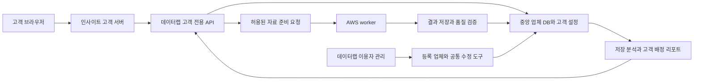

# 인사이트 운영 연결 개발 지침 검토

검토일: 2026-09-30 KST. 이 문서는 사용자가 승인한 별도 도메인·중앙 DB 연결 방식과 데이터랩 이용자 메뉴의 업체 등록·수정 방향을 구체화한다. 이번 작업은 소스와 문서 검토 및 지침 정리다. 운영 DB 변경, 실제 수집, 일정 등록, 배포를 수행하는 지시가 아니다.

## 1. 기준과 현재 상태

- 고객 앱 기준: `codex/insight-render-preview`, `10306fce116a793f828871d4dfce5ae726b32410` 및 작업 중인 로컬 정보 수정 기능. 앞선 로컬 검수에서 테스트 28개를 통과했으나 실제 회원·워커 연결을 검증한 것은 아니다.
- 데이터랩 연결 대상 소스: `codex/hamdeok-retained-recovery`, `ba6d62ba3fc3d586425e9741fe5639c2d90432ec`. 이번에는 해당 소스를 읽었으며 운영 서버 상태를 새로 점검하지 않았다.
- 공개 검수본 배포 기록: [2026-09-29 기록](customer-portal-render-preview-20260929.md). 가상 업체와 임시 세션을 쓰며 실제 고객 서비스가 아니다. 당시 DNS·요금제·접속 상태를 현재 상태로 단정하지 않는다.
- 프로젝트별 별도 `AGENTS.md` 지침은 확인되지 않았고 상위 공통 파일은 비어 있었다. 사용자 결정과 이 개발 계약을 기준으로 한다.
- 이번 지침과 충돌하는 초기 기획의 수집·검수본 공개 범위는 아래 개정 기준을 우선한다. 실제 운영 연결 완료 여부는 [운영 연결 계약](customer-portal-connection-contract.md)의 검수로 판단한다.

## 2. 확정된 구조

- 고객 주소는 `insight.sabun.co.kr`, 내부 관리는 STAYDATALAB이다. 브라우저는 인사이트의 같은 출처 API만 사용하고 서버끼리 인증하여 연결한다.
- 업체 원장·관측 자료·검수값은 데이터랩이 관리한다. 여러 도메인에서 같은 파일/DB를 직접 쓰도록 구성하지 않는다.
- 관리자 진입점은 **이용자 → 이용자 상세 → 등록 업체 → 업체 등록·정보 수정**이다. 현재 데이터랩 메뉴 명칭은 `회원`이므로 중복 관리 메뉴를 추가하지 않고 해당 기능 안에 연결한다. 실제 메뉴명 정리는 화면 구현 시 일관되게 적용한다.
- 업체 DB에서 여는 편집기와 이용자에서 여는 편집기는 같은 `companyId`와 저장 기능을 사용한다. 고객마다 별도 객실 원장을 복제하지 않는다.
- 고객의 별칭·메모는 고객별 설정이고, 객실 수·데이유즈·공통 시설 정보는 중앙 업체의 검수 대상이다. 고객 요청은 승인 전 공통 계산값을 변경하지 않는다.
- 내 매장 1곳, 경쟁업체 기본 3곳, 관심지역 기본 1곳이며 후자의 한도는 관리자가 고객별로 증감한다. 내 매장 소재 지역은 별도 기본 제공한다. 준비 중 고객은 매장 없이 시작할 수 있다.
- `AWS worker`는 현재 UI 이름이며 이번 코드의 `workerKey=scheduled`에 대응한다. 이름만으로 Amazon 인프라를 사용한다고 판단하지 않는다. 고객 화면에는 워커 서버명·키·속도 설정을 노출하지 않는다.

## 3. 실제 코드에서 확인한 추가 개발 항목

| 항목 | 확인 근거 | 필요한 조치 |
| --- | --- | --- |
| 실제 고객 저장 | `customer-portal/server.cjs`, `lib/preview-sessions.cjs`는 예시 메모리 상태를 사용 | 인증·등록 관계·제공 한도·수정 요청·세션을 영구 저장소에 연결 |
| 회원별 등록 업체 편집 | 기존 회원 관리와 업체 DB 수정 API는 별개 | 회원 상세에 연결 업체·확인 상태·한도·수정 요청을 표시하고 공통 편집기로 연결 |
| 기존 2곳 제한 | `publicB2BInterestLodgesForSession`, `saveB2BInterestLodgesForSession`에서 고정 2개 절삭 | 새 등록 모델에 재사용 금지. 3곳 및 고객별 증감·보관·동시 추가 검증 |
| 업체 중복 수집 | `scripts/collection_reuse.cjs`의 `scope`, `covers`, `run`은 동일 키워드를 중심으로 판단 | 서로 다른 키워드·고객의 동일 업체 상세 관측을 재사용하는 별도 판단 추가 |
| 객실 유형 저장 | `sanitizeManualCorrectionRoomSegments`는 `B2B_INTEREST_LODGE_SEGMENT_LIMIT=8`로 절삭 | 입력한 객실 유형을 조용히 버리지 않도록 공통 수정 모델 개선. 이는 과거 수집 상품 40개 제한과 다른 문제 |
| 검수 이력 | `saveCompanyManualCorrectionUnlocked`의 `manualCorrectionHistory`는 최근 30건만 보관 | 별도 영구 감사 이력과 변경 버전 추가. 최근 표시 목록과 전체 보관 이력을 분리 |
| 적용 기간·충돌 | 기존 수동 보정 저장에 숙박일별 적용 기간·요청 기준 버전 검증이 없음 | 실제 객실 증감과 과거 오류 정정을 구분하고 기간별 값 해석·동시 수정 방지 추가 |
| 고객 권한 | 기존 `normalizeUserRole`은 `b2b` 이외 값을 관리자로 정규화 | 새 고객 역할을 해당 함수로 검사하지 않음. 허용한 역할·작업·대상만 통과 |
| 결과 완료 판정 | 기존 워커 요청 영수증·보관 자료 검증 경로가 있음 | 처리 완료, 중앙 저장, 업체 DB 반영, 고객 열람 가능 상태를 구분하고 실패 원인을 보존 |
| 리포트 | 월간 관리자 발행과 PDF는 있음. 고객 배정·공개 필드 및 주간 계산은 별도 | 월간 배정부터 연결하고 주간은 별도 계산 검수 후 제공 |

## 4. 저장과 서버 연결

초기 구현 권고는 **2G 데이터랩의 기존 영속 저장 영역에 고객 전용 저장소를 추가하고 데이터랩 프로세스만 쓰는 구조**다. 인사이트 서버에는 서비스 연결 자격증명만 두고 원장 파일·DB 접속 비밀번호·관리자 세션을 복사하지 않는다.

- 고객 전용 저장소는 별도 SQLite 파일 등 트랜잭션 가능한 저장소로 구현하고, 회원 연결·관계·한도·요청·감사 이력·세션·처리 대기 기록을 버전 관리한다. 구체 경로와 스키마는 1단계 구현에서 확정한다.
- 기존 업체 마스터 JSON과 선택적으로 사용하는 `master_db` SQLite의 운영 모드를 임의 전환하지 않는다. 새 고객 저장소가 생겼다고 기존 SQLite를 곧바로 모든 자료의 기준으로 승격하지 않는다.
- 업체 보정과 고객 요청 승인처럼 두 저장소를 건드리는 작업은 하나의 원자적 저장이라고 가정하지 않는다. `operationId`와 적용 중 상태를 먼저 보존하고, 동일 변경 재적용 방지·실제 반영 확인·재시작 후 정합성 복구를 구현한다. 예약·매출 재계산은 별도 처리 상태로 표시한다.
- 서비스 간 API는 고객 세션 확인 결과와 요청별 권한을 검증한다. 자격증명 하나로 관리자 전체 API를 대행하지 않는다. 읽기, 개인 설정, 수정 요청, 자료 준비 접수 권한을 구분한다.
- 세션은 host-only 쿠키로 발급하며 OPS/관리자 로그인과 공유하지 않는다. 고객 변경·중지·권한 철회가 오래된 세션과 PDF URL에도 적용돼야 한다.
- 백업에는 고객 설정뿐 아니라 업체 연결 ID·검수 버전·처리 영수증이 포함돼야 한다. 별도 검수 저장소에서 재시작·복구 후 일관성을 확인하고, 외부 백업 위치와 보존 기간은 운영 공개 전에 확정한다.

Render는 무료 웹서비스에서 영속 디스크를 지원하지 않으며 로컬 파일은 재시작·재배포·휴면 시 유실될 수 있다고 안내한다. 현재 무료 실물 페이지를 실제 고객 정보 저장소로 사용하지 않는다. 영속 디스크도 서비스 간 공유 파일시스템으로 취급하지 않는다. [Render 무료 서비스](https://render.com/docs/free), [영속 디스크](https://render.com/docs/disks) (2026-09-30 확인).

무료 검수본 유지와 실제 고객 서비스 공개는 별도 결정이다. 서버 API 연결 개발을 위해 지금 요금제를 바꿀 필요는 없으며, 실회원 공개 전 기동 지연·가용성·저장·복구 요구와 요금제를 확정한다.

## 5. 업체 검색·등록·자료 준비

1. 업체명·주소·플레이스 식별 정보로 중앙 DB의 후보를 검색한다. 입력 중이나 목록 열기만으로 외부 수집을 시작하지 않는다.
2. 동명 업체는 소재지와 플레이스 식별자로 구별하고 고객이 정확한 대상을 선택한다. 없는 업체는 `registrationRequestId`로 접수하며 업체번호를 임의 생성하거나 이름만으로 기존 업체에 합치지 않는다.
3. 장소 주소는 허용한 형식을 파싱해 식별자로 변환한다. 고객이 넣은 임의 URL을 서버가 그대로 방문하는 범용 URL 수집 기능을 만들지 않는다.
4. 등록 관계와 소유·운영 확인, 자료 준비 상태는 별도 값이다. 같은 매장을 여러 고객이 신청하면 관리자 확인 대상으로 남긴다.
5. **자료 준비 요청**은 명시적 쓰기 작업으로 별도 제공한다. 서버가 고객 권한·한도·업체 식별·기존 자료의 범위와 품질·진행 중 작업을 확인한 뒤 재사용하거나 처리 대기 상태로 만든다.
6. 고객이 보낸 `workerKey`, 요청속도, 인원, 강제 반복 옵션은 실행 설정으로 받지 않는다. 데이터랩의 허용 프로필과 AWS worker 배정 설정을 사용한다. 인원·날짜·모드는 결과 검증과 중복 판단에는 기록한다.
7. 결과의 실제 `placeId`/업체 연결이 신청 대상과 다르면 등록 업체에 자동 반영하지 않고 확인 필요로 남긴다. 작업 영수증·원본·runId를 보존한다.
8. 브라우저 연결이 끊겨도 이미 접수한 작업은 요청번호로 조회한다. 화면 새로고침, 서버 응답 지연 또는 결과 전달 실패를 새 수집 실행으로 처리하지 않는다.

준비 요청의 대상은 연결된 `companyId` 또는 본인 소유의 `registrationRequestId` 중 하나다. 신규 등록 요청은 업체명·소재지·플레이스 식별 정보로 대상을 먼저 확인한다. 이름만 있고 동명 후보가 여러 개면 후보 선택/관리자 확인 상태로 남기며 임의 업체의 상세 수집이나 고객 연결을 확정하지 않는다. 확인된 `placeId`가 있고 중앙 업체번호가 아직 없을 때는 해당 식별자로 중복을 검사하고, 결과 검증 후 중앙 업체 등록과 신청 관계 연결을 한 번만 마친다. 소유·운영 확인 승인은 이 처리와 별도로 유지한다.

신규 계약에는 `POST /api/customer/v1/data-preparation-requests`, `GET /api/customer/v1/data-preparation-requests/:requestId`를 추가한다. 전자는 항상 새 수집을 실행한다는 의미가 아니다. 자기 접수 건만 조회하며 `accepted / reused / queued / collecting / validating / ready / partial / failed / blocked / needs_review`를 안전한 사유·시각과 함께 반환한다. 실제 작업 상태 매핑과 오류코드는 구현 시 고정한다.

## 6. 업체 단위 중복 방지와 품질

- 고객의 접수 ID와 실제 실행 job ID를 분리한다. 여러 고객의 동일 업체 요청은 하나의 작업을 공유하되 각 고객은 자신의 대상과 접수 상태만 읽는다.
- 상세 자료 재사용 기준은 canonical `companyId`/확인된 `placeId`, 한국시간 관측일, 숙박일 범위, 숙박 길이·인원, 수집 모드, 상품·데이유즈 범위, 원천·스키마 및 정상 응답 범위다. 같은 이름이나 같은 날짜만으로 재사용하지 않는다.
- 정확히 같은 범위는 진행 중 작업에 합류하거나 검증된 결과를 재사용한다. 더 넓은 기존 자료를 쓸 때도 실제 날짜·상품·응답 품질이 요청을 포함하는지 확인한다. 범위가 다르면 필요한 차이를 표시하며 자동 전체 재수집으로 바꾸지 않는다.
- 키워드 검색 순위는 키워드별 독립 관측이다. 경남글램핑의 업체 상세를 산청글램핑에서 재사용할 수 있어도 순위와 검색 노출을 복제하지 않는다. 재사용한 상세의 원래 관측시각·runId도 유지한다.
- 초기 당일 중복 방지와 정기 갱신 정책을 분리한다. 등록 고객이 늘었다는 이유만으로 같은 업체의 외부 요청이 늘어나지 않도록 한다. 중앙 접수와 워커의 작업 임대·영수증을 함께 검증한다.
- 정상 응답 0, 상품 없음, 판매중지 미확정, 오류·차단·누락을 구분한다. 일부 완료에서 정상 행만 사용할 수 있는 경우에도 실제 확보 범위·실패 이유를 남긴다. HTTP 200이나 프로세스 종료만으로 완료하지 않는다.
- 숙박·데이유즈 상품 또는 객실 수에 40개 절삭을 다시 넣지 않는다. 비정상 총량·상품 중복 가능성은 경고로 표시한다. 전송 크기 제한은 임의 잘라 저장하는 대신 명시적 오류/분할 처리로 해결한다.
- 차단 감지·결과 검증·워커 고유 요청 프로필을 유지한다. 차단 후 다른 워커로 자동 전환하거나 차단 보호를 해제하지 않는다. 자동 재시도는 차단과 단순 전달 오류를 구별하며, 전달 오류는 보존 자료 확인을 먼저 한다.

## 7. 공통 수정 도구와 계산

- 업체 DB와 이용자 상세는 같은 저장 명령과 검수 모델을 사용한다. 기존 `/api/company-master/manual-correction`, `/api/company-master/admin-profile`는 관리자 경계 안에서 재사용·확장하며 고객 브라우저에 개방하지 않는다.
- 승인할 때 해당 필드의 기준값·검수 버전과 현재값을 비교한다. 일부 필드만 바꾼 요청이 기존 객실 유형·가격 기준·상품 보정 등 미제출 필드를 비우지 않도록 병합 규칙을 명시한다.
- 객실 총량은 DB 검수값 우선, 없으면 유효한 최대 관측값을 사용한다. 플레이스 객실 안내는 출처가 있는 참고 자료다. 낮은 신뢰도는 경고하며 검수값을 다음 수집으로 덮어쓰지 않는다.
- 객실 수의 단위는 실이고, 가격은 조건이 기록된 숙박 객실 판매금액이다. 데이유즈 유무와 동일 객실 공유 여부는 별도 판정한다. 미확인을 없음으로 바꾸지 않는다.
- 공개 관측은 녹색, 방막기 추정은 보라색으로 구분하고 라이트·다크 양쪽에서 상태 글자를 함께 제공한다. 방막기를 추정 매출에 포함하더라도 확정 결제·공개 예약으로 합치지 않는다. 객실 공유 보정은 기존 계산 규칙을 유지한다.
- 실제 객실 증감은 적용 숙박일 이후에만 적용한다. 과거 입력 오류 정정은 영향 기간·변경 전후 예약/매출을 확인한 뒤 적용한다. 기간 규칙을 구현하기 전 전체 과거에 자동 소급하는 기능을 공개하지 않는다.
- 변경 이력은 승인·반려·철회·대체·해제와 실행 결과를 보존한다. 개인 메모, 내부 검수 메모, 고객 공개 검수 사유를 구분한다. 고객에게 다른 고객의 요청 내용이나 검수자 개인정보를 보내지 않는다.
- 기존에 절삭되어 남아 있지 않은 이력은 근거 없이 복원했다고 표시하지 않는다. 현존 이력을 보존 이관하고 새 검수부터 전체 이력을 누적한다.
- 미발행 분석은 영향 범위만 다시 계산한다. 계산 중·계산 실패·새 기준 반영을 구분하고 과거 수치를 새 기준 수치처럼 보여주지 않는다. 발행 리포트는 그대로 보존하고 수정 발행본을 별도로 배정한다.

## 8. 남은 운영 정책과 권고

다음 항목은 구현을 막는 질문이 아니라 운영 연결·공개 전에 확정할 정책이다. 확정 전에는 해당 자동 실행 기능을 끈 채 개발한다.

| 항목 | 권고 출발점 | 아직 정하지 않은 내용 |
| --- | --- | --- |
| 자료 갱신 | 중앙 저장 검색 우선, 명시적 준비 요청, 당일 동일 범위 재사용 | 실제 수집 숙박일 범위·주기·일일 접수량·회원별 갱신 허용량 |
| 데이유즈 | 기존 결정대로 유무 확인을 기본으로 하며 공유 여부 불명확 표시 | 상세 추가 확인을 요청/실행하는 운영 기준 |
| 소유·운영 확인 | 관리자 확인 후 내 매장 연결 승인 | 제출 정보·확인 방법·확인 책임자. URL 등록만으로 승인하지 않음 |
| 계정 운영 | 기존 회원 ID와 새 고객 ID를 연결하되 로그인 권한 분리 | 연락처 확인·비밀번호 복구·탈퇴 및 보관 범위 |
| 발행 | 월간 먼저, 관리자 검토 후 고객 배정 | 주간 계산 기준 확정, 자동 발행 시각·메일/문자 발송 여부 |
| 운영 환경 | 검수용 무료 서비스 유지, 데이터랩 측 영속 저장 설계 | 실제 공개 요금제·별도 백업 위치·복구 목표·도메인/TLS |

회원 동의 문구와 데이터 제공 범위는 실제 사용하는 기능·연락처·리포트 항목에 맞춰 공개 전에 정비한다. 별도 도메인으로 분리했다고 자료 사용 권한이나 책임이 바뀌는 것으로 설명하지 않는다. 이 문서 검토에서 법률 판단이나 새 수집 허용 여부를 확정하지 않았다.

## 9. 개발 순서와 완료 기준

| 순서 | 개발 범위 | 완료 기준 |
| --- | --- | --- |
| 1 | 고객 영속 저장·계정/서비스 인증·canonical 업체 연결·제공 한도 | 재시작 후 보존, 고객 A/B 격리, 중복 관계/동시 슬롯/축소 이력 검증 |
| 2 | 데이터랩 이용자 상세의 등록 업체·공통 편집기·검수 요청/승인 | 업체 DB와 같은 값, 8개 초과 유형과 30건 초과 이력 보존, 적용 기간·동시 수정·부분 필드 보존 검증 |
| 3 | 인사이트 검색/자료 준비와 AWS worker 접수 연결 | 요청 중복 방지, 다른 키워드 동일 업체 재사용, 실제 대상 확인, 차단/전달 실패 분리, 중앙 저장·DB 반영까지 확인 |
| 4 | 허용된 업체/지역 분석과 월간 발행본·PDF | 고객별 범위·화면/PDF 수치 일치, 미확보 표시, 발행본 불변·철회 후 접근 거부 |
| 5 | 주간 계산, 실제 가입~열람 검수, 도메인 공개 | 비교 가능한 기간·표본 검증, PC/모바일·라이트/다크, 실서비스 커밋·배포·인증 확인 |

1~2단계는 외부 수집 없이 검수 데이터로 진행할 수 있다. 3단계도 먼저 모의 워커·격리 저장소로 계약을 검증하고, 실제 수집 검증은 대상·날짜·범위를 정한 별도 운영 실행으로 관리한다.

인사이트 브랜치는 데이터랩 최신 수정과 기준 커밋이 다르다. 인사이트 전체 브랜치를 기존 2G/워커에 배포해 최신 수집 수정이 되돌아가게 하지 않는다. 데이터랩 변경은 최신 운영 코드에서 구현·검증하고, 고객 앱 변경은 해당 서비스에만 배포한다. 워커 코드/작업 계약이 바뀐 경우에만 영향을 받는 워커 배포를 계획한다. API는 서버를 먼저 호환 배포하고 고객 앱을 연결하며, 롤백 시 새 저장 스키마를 이전 코드가 훼손하지 않는지 검증한다.

이번 개정은 문서 간 기준과 로컬 링크를 검수한다. 실행 코드는 바꾸지 않으므로 앞선 28개 테스트를 이번 작업에서 다시 실행한 것으로 기록하지 않는다.

## 구현 진행 기록

[2026-10-01 연결 구현 현황](customer-portal-connection-implementation-20261001.md)에 완료 범위, 검증 근거, 남은 단계와 운영 미배포 상태를 기록했습니다.
