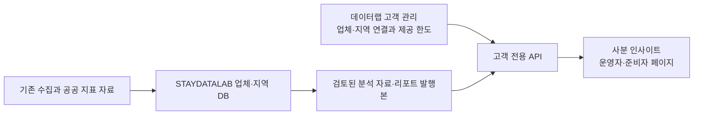

# 사분 고객 분석 서비스 기획안

작성일: 2026-09-28 · 상태: 1차 실물 페이지 구현·로컬 검수 완료, 운영 연결 전 · 가칭: SABUN INSIGHT / 사분 인사이트

이 문서는 고객용 화면 제작과 이후 연결을 위한 계획이다. 사용자가 2026-09-28 고객 서비스 주소를 **insight.sabun.co.kr**로 확정하고 순차 개발을 지시했다. 실제 DNS 연결과 운영 배포는 별도 단계다. 운영 회원 정책과 수집 일정은 변경하지 않는다.

## 1. 목적과 역할

숙박업 운영자와 창업 준비자가 내 매장·경쟁업체·지역의 흐름을 살펴보고, 검토된 주간·월간 리포트를 받는 고객 서비스를 만든다.

| 서비스 | 역할 |
| --- | --- |
| SABUN 홈페이지 | 서비스 소개와 상담 진입 |
| SABUN OPS | 기존 숙박 운영 업무 |
| STAYDATALAB | 수집, 업체·지역 DB 검토, 지표 계산, 리포트 작성·발행, 고객 제공 범위 관리 |
| 새 고객 서비스 | 회원가입, 매장·경쟁업체·관심지역 설정, 고객에게 허용된 분석과 리포트 열람 |

고객 화면에는 수집 워커, 원본 응답, 관리자 수정 도구를 넣지 않는다. 회원이 매장을 선택하거나 리포트를 열 때 새 크롤링을 시작하지 않는다. 자료가 없으면 자료 준비 상태와 요청 접수 기능을 제공하고, 실제 자료 준비는 데이터랩에서 관리한다.

## 2. 서비스명과 도메인

추천 가칭은 **SABUN INSIGHT · 사분 인사이트**다. 주간·월간 리포트뿐 아니라 경쟁 분석과 입지 분석까지 담을 수 있는 이름이다.

| 후보 | 판단 | 적용 조건 |
| --- | --- | --- |
| `insight.sabun.co.kr` | 사용자 확정. OPS와 사분 브랜드 체계를 이어가며 분석 서비스임을 표현한다. | 공개 전 sabun.co.kr DNS 관리권한, 기존 레코드 충돌, TLS 연결 확인 |

권장 주소 구성은 고객 `/`, `/signup`, `/login`, `/app`이며 고객 관리 화면은 기존 데이터랩에 둔다. 별도 도메인을 선택하더라도 페이지 구조와 데이터 연결 방식은 동일하게 유지한다.

확정된 주소는 기존 sabun.co.kr의 하위 도메인이므로 해당 DNS 영역에 레코드를 구성한다. 주소 확정이 실제 DNS 설정 완료를 뜻하지 않는다. 이전 독립 도메인 후보는 개발 대상에서 제외한다.

참고: [Cloudflare 하위 도메인 DNS 안내](https://developers.cloudflare.com/dns/manage-dns-records/how-to/create-subdomain/), [KRNIC 도메인 등록 안내](https://www.nic.or.kr/jsp/business/management/domain/registrationInfo.jsp). 현재 DNS 제공자가 Cloudflare라는 뜻은 아니다.

## 3. 최초 등록과 회원 유형

가입 후 첫 화면에서 **내 매장 등록 / 매장 준비 중**을 선택한다. 이 선택은 사업 준비 상태이며, 회원의 승인·이용 중·중지 상태와 별도로 관리한다.

| 항목 | 내 매장 등록 | 매장 준비 중 |
| --- | --- | --- |
| 기본 대상 | 운영하거나 보유한 매장 1곳 | 준비 프로젝트 1개 |
| 등록 방법 | 매장명·주소·플레이스 URL로 검색 후 정확한 업체 선택 | 예정 업종, 관심지역 선택. 가칭·예정 주소·개업 목표는 선택 입력 |
| 중앙 업체 연결 | 고유 업체번호로 연결. 목록에 없으면 관리자 확인 요청 | 실제 업체번호 강제 생성 없음 |
| 확인 상태 | 매장 연결 요청 / 확인 중 / 확인 완료 / 추가 정보 필요 | 준비 중. 향후 실매장 연결 가능 |
| 홈 화면 | 내 매장 요약, 경쟁업체 변화, 소재 지역 동향, 최신 리포트 | 관심지역 동향, 비교업체, 준비 정보, 최신 리포트 |
| 자기 매장 실적 | 유효 자료가 있는 범위에서 표시 | 존재하지 않는 실적을 0으로 표시하지 않음 |

매장명 입력만으로 소유·운영 확인을 완료하지 않는다. 등록 자체와 관리자 확인을 구분한다. 한 매장을 여러 사람이 신청한 경우 자동으로 연결하지 않고 확인 대상으로 남긴다.

준비 중에서 내 매장 등록으로 전환해도 같은 고객번호를 사용하고, 경쟁업체·관심지역·기존 리포트는 유지한다. 본인 매장이 기존 비교업체 목록에 있으면 역할을 바꾸고 중복 슬롯을 반환한다.

가입 단계는 `계정 생성 → 유형 선택 → 매장 또는 준비 정보 → 경쟁업체·관심지역 선택 → 설정 확인`이다. 경쟁업체 선택은 나중에 완료할 수 있다. 기존 회원의 활성 상태 관리와 신규 매장 연결 검토를 구분한다. 현재 가입 코드가 활성 회원을 생성하므로 별도의 가입 승인제를 이미 구현된 것으로 간주하지 않는다. 매장 확인 여부와 자료 준비 여부도 서로 다른 안내로 표시한다.

## 4. 등록 한도와 관리자 변경

최초 기본값은 내 매장 1곳, 경쟁업체 3곳, 관심지역 1곳으로 제안한다. 경쟁업체·관심지역 한도는 화면이나 코드의 고정 숫자로 두지 않고 관리자 설정으로 읽는다.

| 설정 | 최초 기본값 | 관리자 동작 |
| --- | --- | --- |
| 경쟁업체 허용 수 | 3곳 | 고객별 정수 수량 증감 |
| 관심지역 허용 수 | 1곳 | 고객별 정수 수량 증감 |
| 주간 리포트 제공 | 제공 대상으로 설정 | 고객별 제공 여부·발행본 배정 |
| 월간 리포트 제공 | 제공 대상으로 설정 | 고객별 제공 여부·발행본 배정 |
| 이용 상태 | 기존 승인 정책과 연결 | 승인 대기 / 이용 중 / 중지 |

관리자 `고객관리 → 고객 상세 → 제공 범위`에 현재 사용량·허용량·변경 입력을 둔다. 예: `경쟁업체 3 / 5곳`, `관심지역 1 / 2곳`. 신규 회원 기본 한도와 고객별 예외값을 구분하고, 기본값 변경을 기존 고객에게 무조건 소급하지 않는다.

한도에는 0 이상의 정수만 허용한다. **0은 추가·활성 등록 허용 없음**이다. 무제한이라는 의미로 사용하지 않는다. 고객의 추가 문의는 서비스 안에서 접수하며 한도 증가·과금·외부 메시지를 자동 실행하지 않는다.

지역 한도는 다음과 같이 구분한다.

- 내 매장이 연결된 고객: 매장 실제 소재 지역은 기본 제공하며 관심지역 한도에서 차감하지 않는다.
- 준비 중 고객: 첫 선택 지역을 관심지역 1곳으로 사용한다. 별도의 무료 지역을 자동 추가하지 않는다.
- 소재 지역과 같은 관심지역은 중복 등록하지 않는다. 경쟁업체의 주소 표시는 추가 지역 분석 권한을 자동 부여하지 않는다.
- 전체 지역 분석의 단위는 시군구다. 상위 시도는 검색·위치 설명에 사용한다.

**한도를 줄일 때**는 저장 전에 영향을 받는 대상을 보여준다. 관리자가 유지할 대상을 선택한 뒤 한도 변경과 나머지 대상의 비활성 보관을 함께 적용한다. 등록 자료를 임의로 잘라 버리지 않는다. 기존 발행 리포트는 당시 대상과 수치를 유지하고, 이후 분석·발행에는 활성 대상만 사용한다. 고객 화면에도 변경된 제공 범위를 표시한다.

활성 대상과 연결 검토 중인 요청은 슬롯을 사용한다. 거절·취소·비활성 보관 항목은 사용하지 않는다. 같은 업체번호·지역코드 중복, 본인 매장의 경쟁업체 등록, 여러 창의 동시 추가로 한도 초과가 발생하지 않도록 서버에서 검증한다. 변경 이력에는 전후 값, 관리자, 시각, 사유를 남긴다.

경쟁업체 교체 시점도 기록한다. 교체 전후 서로 다른 업체를 동일한 비교 표본으로 표현하지 않는다. 교체 횟수 제한이나 유료 상품별 수량은 이번 계획에서 임의로 정하지 않는다.

## 5. 고객 화면 구성

고객 메뉴 순서는 **홈 → 내 매장 → 경쟁 분석 → 지역 분석 → 리포트 → 설정**으로 통일한다. 준비 중 회원은 내 매장 페이지에 준비 프로젝트를 표시하고, 같은 위치에서 실매장으로 전환할 수 있게 한다.

| 화면 | 주요 내용 | 필요한 상태 |
| --- | --- | --- |
| 서비스 소개·가입 | 운영자/준비자별 활용 목적, 기능 소개, 가입·로그인 | 가입 가능, 동의, 가입 완료, 승인 대기 |
| 최초 등록 | 유형 선택, 매장 검색, 경쟁업체 선택, 관심지역 선택 | 미등록, 확인 중, 한도 도달, 등록 완료 |
| 홈 | 대상·기간 요약, 핵심 변화, 최신 리포트, 다음 확인 항목 | 운영형 / 준비형 / 자료 준비 중 |
| 내 매장 | 매장 정보, 객실 기준, 예약·가격·추정매출, 관측 추이 | DB 검토값, 추정값, 자료 미확보 |
| 경쟁 분석 | 내 매장과 활성 경쟁업체 비교, 기간별 변화 | 비교 가능 / 대상 변경 / 자료 부족 |
| 지역 분석 | 소재 지역 및 관심지역 선택, 관광·인구·산업·검색 지표 | 기준기간, 저장 시각, 일부 자료 없음 |
| 리포트 | 주간·월간 전환, 기간 검색, 발행본 상세, PDF | 준비 중, 발행, 수정본, 제공 대상 아님 |
| 설정 | 매장 유형, 경쟁업체, 관심지역, 이용 범위, 계정 | 사용량/한도, 추가 문의, 연결 검토 상태 |

업체 선택은 주소 순서 목록에 의존하지 않는다. 업체명·주소·플레이스 URL로 찾고, 카드에 이름·시군구·업종·식별 가능한 주소를 표시해 동명 업체를 구별한다. 최종 저장은 업체명 문자열이 아닌 중앙 업체번호를 기준으로 한다.

## 6. 디자인 기준과 첫 검수본

기존 STAYDATALAB과 SABUN OPS의 아이보리·흰 표면·짙은 녹색·차콜 계열을 이어간다. 본문은 Pretendard, 주요 제목은 기존 마루부리 계열을 활용한다. 대시보드에는 주요 지표 3~4개를 먼저 두고 설명과 상세 표는 펼쳐 볼 수 있게 한다.

공개 관측은 녹색, 방막기 추정은 보라색, 검토가 필요한 객실 기준은 경고 표시로 구별한다. 색상에만 의존하지 않고 상태 이름·아이콘을 함께 둔다. 자료 미확보와 정상 0을 다르게 표시한다. 라이트·다크 모드에서 텍스트와 배경 대비를 각각 검수한다.

PC는 좌측 메뉴와 본문, 모바일은 같은 이름·순서의 접이 메뉴와 한 열 카드로 구성한다. 작은 화면에서는 경쟁 표를 업체별 카드 또는 가로 스크롤 표로 바꾸고, 날짜·금액·상태가 잘리지 않도록 한다. PDF는 밝은 인쇄용 레이아웃으로 제공한다.

첫 제작은 실제로 클릭 가능한 반응형 페이지다. 예시 계정 A는 매장 등록, 예시 계정 B는 준비 중으로 구성한다. 모든 수치에 예시 데이터임을 표시하며 실제 업체의 비공개 자료와 관리자 정보는 사용하지 않는다. 가입 진행, 업체 검색·선택, 한도 도달, 지역 전환, 리포트 열람을 동작시킨다. 관리자 시안에는 경쟁업체 3→5곳, 관심지역 1→2곳 및 한도 축소 시 유지 대상 선택도 포함한다.

검수 화면: PC 1440·1280px, 모바일 390·360px, 키보드 이동, 확대 시 줄바꿈, 라이트·다크, 빈 화면·오류·로딩·권한 없음.

## 7. 리포트 운영

| 구분 | 제안 내용 | 집계 원칙 |
| --- | --- | --- |
| 주간 | 예약 추정 변화, 게시·관측 가격 변화, 키워드 순위, 경쟁업체 변화, 관심지역 동향 | 기본 관측 주는 한국시간 월~일로 제안. 비교하는 숙박일 범위를 별도 명시하고 동일 업체·동일 숙박일·동일 객실 기준의 관측만 비교 |
| 월간 | 숙박월별 예약·추정매출, 평일/주말·휴일, 관측 리드타임, 경쟁·지역 배경, 전월 비교 | 숙박일 기준 월 집계. 같은 업체·숙박일 최신 유효 관측 1건. 여러 키워드·반복 관측 중복 합산 금지 |

월말이 지났다는 사실만으로 실제 매출 확정으로 표시하지 않는다. 관측 마감일, 자료 충족률, 공개 예약·방막기 추정, 가격 누락, 객실 기준을 함께 제공한다. 주간 변화량의 합을 월간 매출로 사용하지 않는다. 관측 기반 리드타임은 실제 예약 생성 시각과 구분한다.

고객별 발행 흐름은 `저장 자료 준비 → 초안 → 운영자 검토 → 발행 → 고객에게 배정 → 고객 보관함`이다. 첫 버전은 관리자 검토 발행을 기본으로 한다. 자동 발행·이메일·문자 알림은 별도 후속 범위로 두며 임의의 발송 일정을 만들지 않는다.

배정한 고객, 대상 업체·지역, 기간, 버전, 발행 시각, 근거를 발행본에 고정한다. 정정은 새 버전으로 발행하고 과거본을 덮어쓰지 않는다. 고객 페이지와 PDF의 수치는 같은 발행 스냅샷을 사용한다. 대상이 바뀌어도 당시 배정된 과거 리포트는 보존한다.

관광·KOSIS·검색 트렌드는 준비된 저장 자료를 재사용한다. 지표마다 실제 기준기간을 표시하고, 연간 인구·산업 자료를 월간 통계인 것처럼 바꾸지 않는다. 독립 조회한 검색 트렌드 상대지수를 합산하지 않는다. 지역 지표는 매장의 실제 소재지·선택한 관심지역과 정확히 연결한다.

## 8. 내부 연결과 데이터 구조

고객 서비스는 별도 웹 앱과 고객용 API로 구성한다. 업체 원장과 수집 원본의 기준은 현재 데이터랩에 둔다. 고객용 API는 허용된 읽기 자료와 설정 변경만 제공한다. 관리자 API 또는 원본 DB를 브라우저에 직접 연결하지 않는다. 도메인이 달라도 각 고객의 업체·지역·리포트 권한을 요청마다 검사하고, 파일 주소를 알거나 PDF 링크를 복사했다고 다른 고객 자료를 열 수 없도록 한다.

로그인 세션은 고객 호스트에 한정하고 OPS·데이터랩 관리자 세션을 자동 공유하지 않는다. 공개 페이지와 고객 자료 응답의 캐시를 구분한다. API 응답·고객 저장소에 내부 메모, 인증키, 워커 설정을 포함하지 않는다. 기존 서비스와 고객 서비스의 배포를 분리해 고객 페이지 변경이 수집 서버 재시작을 요구하지 않도록 한다.

권장 데이터 항목은 다음과 같다. 명칭은 구현 시 기존 구조에 맞춰 확정한다.

| 데이터 | 핵심 항목 |
| --- | --- |
| 고객 | 고유 고객번호, 회원 연결, 사업 단계, 이용 상태 |
| 매장/준비 프로젝트 | 업체번호 또는 준비 정보, 연결 검토 상태, 실제 소재 지역 |
| 제공 범위 | 경쟁업체 한도, 관심지역 한도, 리포트 제공 여부, 변경 버전 |
| 경쟁업체 연결 | 고객번호, 업체번호, 활성/검토/보관 상태, 유효 시작·종료 |
| 관심지역 연결 | 고객번호, 공식 지역코드, 활성/보관 상태, 유효 시작·종료 |
| 리포트 배정 | 고객번호, 발행본 번호·버전, 당시 대상 집합, 열람 상태 |
| 변경 이력 | 대상, 전후 값, 변경자, 시각, 사유 |

초기에는 고객 한 명의 작업공간을 기준으로 한도를 적용한다. 추후 같은 고객사 직원이 늘어도 계정마다 경쟁업체 한도를 복제하지 않도록 고객번호와 로그인 계정을 분리한다. 조직 초대·다중 직원 권한 화면은 후속 범위다.

## 9. 현재 코드에서 확인한 재사용 범위

2026-09-28 로컬 소스 확인 기준이며 이번 문서 작성에서 운영 실사용 연결을 재검증한 것은 아니다.

- 회원의 `owned` / `planning` 분기, 가입·비밀번호 처리·동의·관리자 회원 활성 상태 관리가 있다. 고객 화면의 이름과 흐름을 조정해 활용할 수 있다. 신규 매장 연결 확인과 고객별 제공 권한은 추가 개발한다.
- 기존 관심숙소는 서버·화면의 고정 2곳 제한이며 조회·저장 중 잘라내는 처리도 있다. 이번 경쟁업체·지역별 한도 요구를 충족하지 않으므로 동적 한도와 보존 이관을 새로 구현해야 한다.
- 월간리포트에는 집계, 검토, 불변 발행본, PDF가 있다. 현재 관리자 전용이므로 고객별 배정·열람 API는 추가가 필요하다.
- 지역별 관광·KOSIS·검색 트렌드 자료 준비는 재사용 가능하다. 고객 접속마다 수집하지 않는 기존 저장 자료 기반 원칙을 유지한다.
- 고객별 주간리포트는 추가 개발 범위다. 기존 B2B 화면을 그대로 공개하는 방식으로 고객 권한 분리를 대신하지 않는다.

관련 소스: `scripts/glamping_app_server.cjs`, `web/app.js`, `web/admin-theme.css`, `scripts/lib/monthly_report_http.cjs`, `docs/monthly-reports.md`, `docs/regional-report-preparation.md`.

## 10. 개발 순서와 단계별 완료 기준

| 단계 | 작업 | 검수 결과 |
| --- | --- | --- |
| 1. 구조 확정 | 등록 두 유형, 메뉴, 고객별 제공 한도, 업체·지역 식별 규칙, API 응답 구조 | 화면과 데이터 연결의 공통 설계 |
| 2. 대표 화면 디자인 | 홈·최초 등록·리포트 상세·관리자 한도 카드 | PC/모바일, 라이트/다크 대표 화면 |
| 3. 전체 실물 페이지 | 고객 메뉴와 관리자 제공 범위 시안, 예시 계정 두 유형 | 주요 흐름을 실제 클릭해 검수 가능 |
| 4. 회원·설정 연결 | 고객 인증, 매장 연결, 경쟁업체·지역 관리, 관리자 한도, 기존 자료 이관 | 한도 변경·축소·동시 추가·준비 중 전환 검증 |
| 5. 분석·월간 연결 | 고객별 저장 분석 자료, 소재 지역·관심지역 지표, 월간 발행본·PDF 배정 | 고객 A가 고객 B의 목록·본문·PDF를 볼 수 없음. 화면/PDF 수치 일치 |
| 6. 주간 연결 | 비교 가능 관측 집계, 주간 초안·검토·배정 | 동일 비교 대상 검증, 누락·대상 교체·객실 기준 변경 표시 |
| 7. 운영 공개 | 도메인 확정, DNS·TLS, 별도 서비스 배포, 가입부터 발행본 열람까지 검수 | 실제 가입·대상 설정·관리자 조정·고객 리포트 열람 확인 |

각 단계는 하나의 검수본으로 확인하고 다음 연결로 넘어간다. 개발 기간은 기존 코드 재사용 범위와 연결 검증 결과를 보고 산정하며, 이번 기획 단계에서 근거 없는 완료 날짜나 요금을 확정하지 않는다.

## 11. 첫 버전에서 반드시 검증할 상황

- 준비 중 회원이 매장번호 없이 가입을 마치고 허용된 지역·경쟁업체 자료를 볼 수 있다.
- 내 매장과 경쟁업체의 이름이 같거나 여러 키워드에 중복 노출되어도 업체번호로 정확히 연결된다.
- 관리자 한도 증가는 고객 화면에 반영되고, 감소는 명시적으로 유지 대상을 선택하며 과거 자료를 지우지 않는다.
- 경쟁업체·지역 0개 허용, 요청 중인 등록, 동시 추가, 허용되지 않은 API 직접 호출을 일관되게 처리한다.
- 다른 고객의 리포트 번호·PDF 주소를 넣어도 읽을 수 없다. 공개 페이지 미리보기에 내부 자료가 포함되지 않는다.
- 준비 중 → 매장 등록 전환과 경쟁업체 교체 전후 이력이 이어지고, 과거 발행본이 바뀌지 않는다.
- 수집 오류의 0·가격 미확보·객실 기준 검토 경고가 정상 실적으로 바뀌지 않는다.
- 보고서 발행·고객 열람이 외부 수집이나 새 예약 수집을 시작하지 않는다.
- 고객 도메인의 배포·세션 변경이 기존 OPS와 데이터랩 관리자 로그인에 영향을 주지 않는다.

## 12. 후속 확정 항목

도메인은 insight.sabun.co.kr로 확정됐다. 서비스명은 SABUN INSIGHT를 가칭으로 사용한다. 이용 요금·결제, 자동 발행 시각, 외부 알림 채널, 조직 직원 초대, 다점포, 경쟁업체 교체 횟수 정책은 첫 화면 제작에 필요하지 않은 후속 항목이다. 임의로 가격·발행일·제공 성과를 화면에 넣지 않는다. 약관·개인정보 안내는 실제 고객 회원가입과 제공 기능이 확정된 범위에 맞춰 공개 전에 정비한다.
